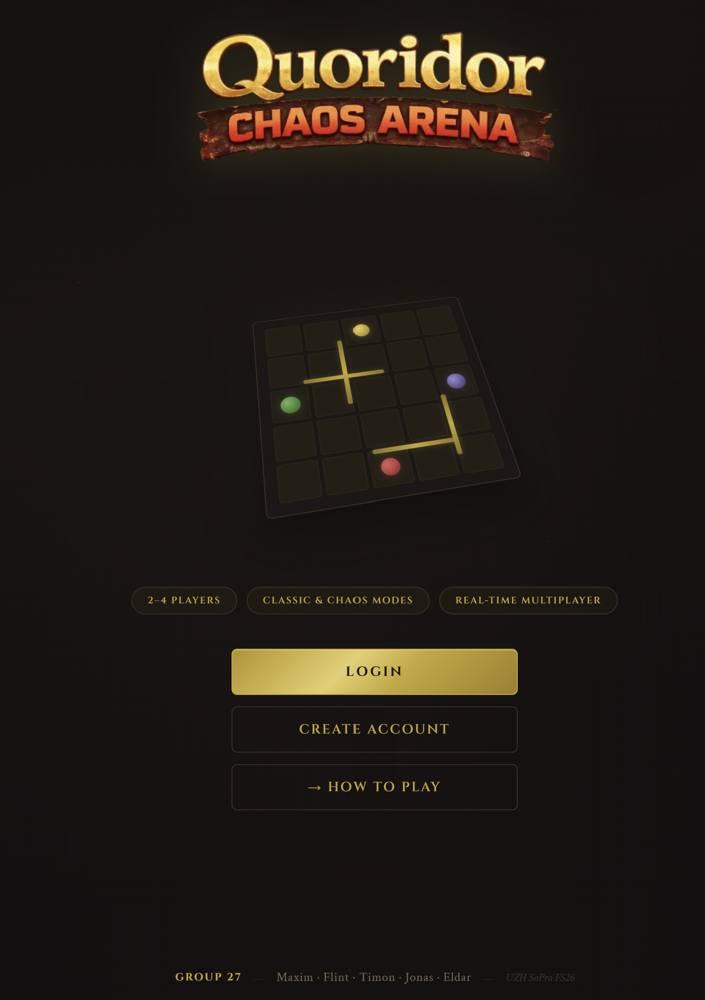
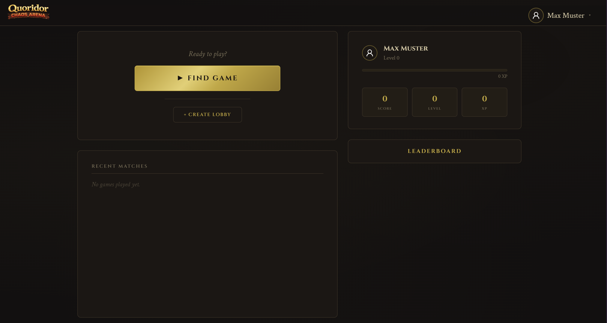
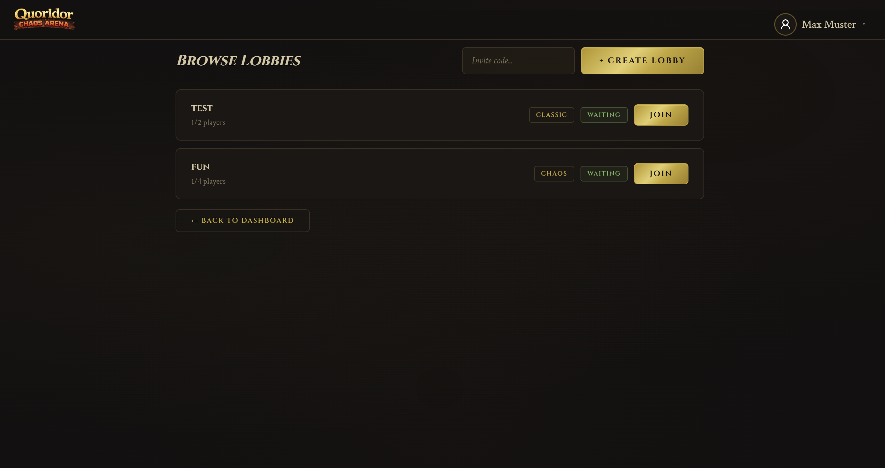
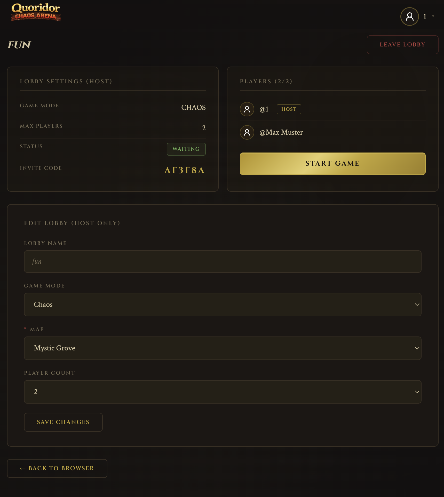
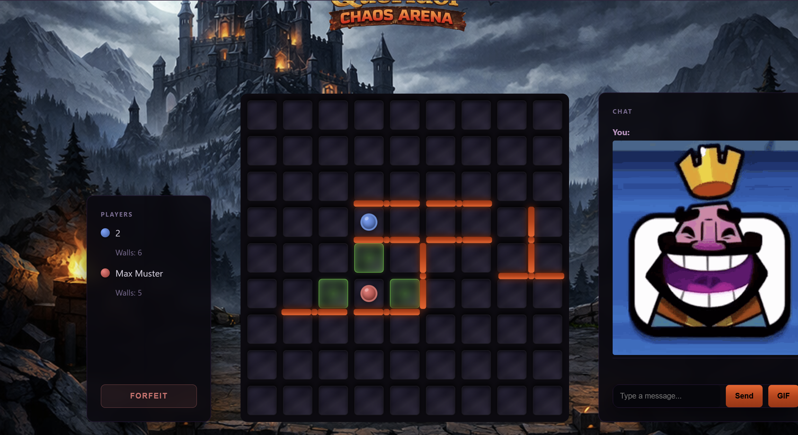
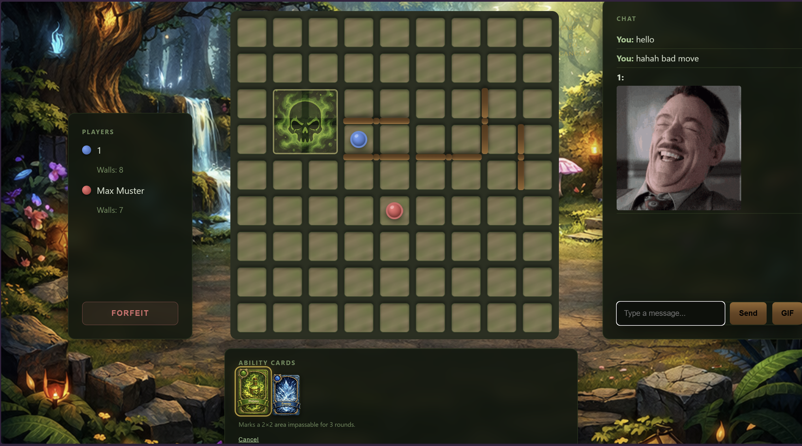
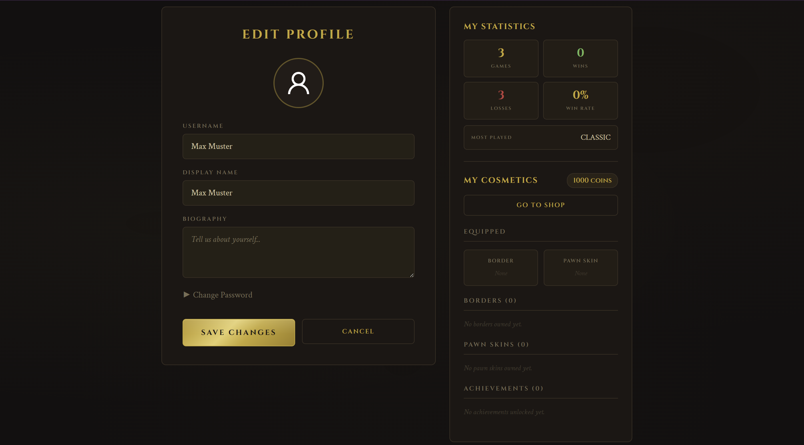
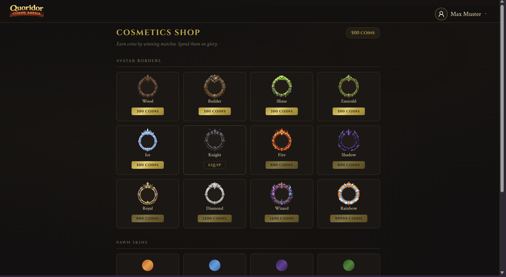
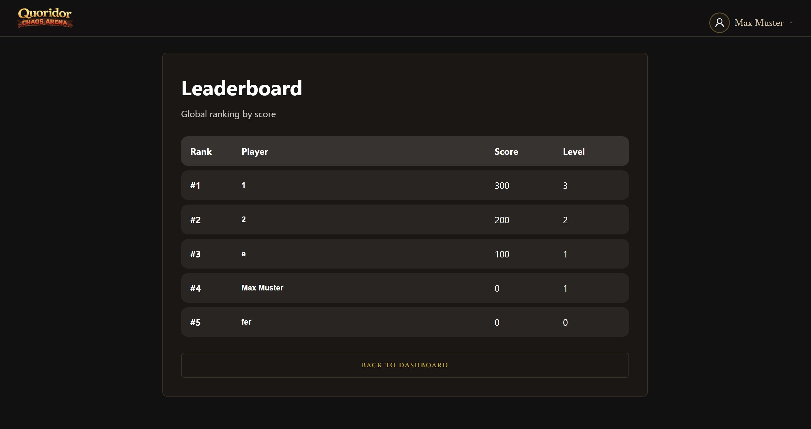

# Quoridor Chaos Arena

## Introduction

Quoridor is a strategic board game built around two core movements wall placement and pawn movement with the goal
of reaching the opposite side of the board befor your opponent. The goal of this project is to make Quoridor
playable as a modern online multiplayer web application, while making the classic experience something more
exciting by adding modern competitive features and a new chaos game mode and a four player option which turn the
whole game upside down. To do that we implemented profiles, progression, cosmetics, lobbies, chat, leaderboards,
map themes, and a Chaos mode with special abilities.

The frontend is responsible for turning the game logic into an accessible and engaging user experience. It guides
users from landing page to login, lobby selection, real-time gameplay, post-game results, profile progression, and
customization. The motivation behind the client design is to make the multiplayer flow clear, responsive, and
visually understandable, even when players interact through moves, walls, abilities, chat messages, and live
game-state updates.

## Technologies Used

- TypeScript
- Next.js / React
- Ant Design
- REST API integration
- WebSocket client integration
- CSS modules and global styles
- Docker

## High-Level Components

### API and Shared Client Infrastructure

The API layer is implemented in [`apiService.ts`](app/api/apiService.ts) and exposed through [`useApi.ts`](app/hooks/useApi.ts). It uses HTTP requests, token handling, JSON parsing, and error handling for all backend communication.

Authentication tokens and user IDs are stored through [`useLocalStorage.tsx`](app/hooks/useLocalStorage.tsx). Global navigation is handled by [`NavBar.tsx`](app/components/NavBar.tsx), which gives users access to their profile, the cosmetics shop, and logout functionality.

### Authentication, Dashboard and Profile System

The entry flow starts at the landing page [`app/page.tsx`](app/page.tsx), then continues through [`login/page.tsx`](app/login/page.tsx) and [`register/page.tsx`](app/register/page.tsx). After authentication, users are sent to the dashboard in [`users/page.tsx`](app/users/page.tsx).

The profile page [`users/[id]/page.tsx`](app/users/[id]/page.tsx) supports profile viewing and owner-only editing. It displays user information, avatar, biography, score, XP, level, achievements, statistics, cosmetics, and match history. The same page also links to the cosmetics shop and allows users to equip owned cosmetics.

### Lobby Flow and Match Setup

Lobby browsing is implemented in [`lobbies/page.tsx`](app/lobbies/page.tsx). Users can view open lobbies, join by invite code, or navigate to lobby creation.

Lobby creation is implemented in [`lobby/page.tsx`](app/lobby/page.tsx), where users choose lobby name, game mode, maximum players, and map theme. The waiting-room view [`lobby/[id]/page.tsx`](app/lobby/[id]/page.tsx) shows players in the lobby, allows host-side settings updates, supports leaving the lobby, and starts the match when ready.

The lobby view uses polling and WebSocket refresh events so players are redirected once the game starts.

### Game Board, Real-Time Gameplay and Abilities

The main gameplay page is [`games/[gameId]/page.tsx`](app/games/[gameId]/page.tsx). It loads game state from the backend, connects to the game WebSocket, reacts to game events, handles game-over redirection, and coordinates user actions such as moving, placing walls, forfeiting, drawing ability cards, and using abilities.

The board UI itself is implemented in [`QuoridorBoard.tsx`](app/components/QuoridorBoard.tsx). It renders pawn cells, wall slots, valid move indicators, player positions, wall placement previews, poison/effect zones, map themes, and ability targeting overlays.

Chaos mode supports ability cards such as Fireball, Earthquake, Freeze, Poison, Plus Two Walls, and Two Moves. The frontend displays ability cards, targeting previews, animations, sounds, and feedback based on the selected ability.

### Chat, GIFs and Game Interaction

In-game chat is implemented in [`GameChat.tsx`](app/components/GameChat.tsx). It retrieves chat history, sends messages to the backend, and supports GIF search and sending through the backend GIF endpoint.

The chat refreshes when WebSocket game events arrive, allowing players to communicate during active matches.

### Shop, Cosmetics, Leaderboard and Instructions

The cosmetics shop is implemented in [`shop/page.tsx`](app/shop/page.tsx). Users can buy borders and pawn skins with coins, equip owned items, and see their current coin balance.

The leaderboard page [`leaderboard/page.tsx`](app/leaderboard/page.tsx) displays all registered users ranked by score and links each entry to the corresponding profile page.

The instructions page [`instructions/page.tsx`](app/instructions/page.tsx) explains the game rules, interface, Chaos mode abilities, progression, leaderboard, and match statistics.

## Launch and Deployment

### Prerequisites

- Node.js 18 or newer
- npm
- Backend running locally on `http://localhost:8080`
- Optional: Deno, if using the provided template tasks
- Optional: Docker

### Install Dependencies

```bash
npm install
```

### Run Locally

```bash
npm run dev
```

The frontend starts on:

```text
http://localhost:3000
```

### Build

```bash
npm run build
```

### Start Production Build

```bash
npm start
```

### Lint and Format


```bash
deno task dev
deno task build
deno task start
deno task lint
deno task fmt
```

### Environment Configuration

The client determines the backend URL through [`domain.ts`](app/utils/domain.ts) and environment configuration files. For local development, the backend should run on:

```text
http://localhost:8080
```

For production, configure the relevant public backend URL, for example through `NEXT_PUBLIC_PROD_API_URL` if used by your deployment setup.

### Docker

Build the frontend Docker image:

```bash
docker build -t quoridor-frontend .
```

Run the container locally:

```bash
docker run -p 3000:3000 quoridor-frontend
```

### Releases

A typical release flow is:

1. Ensure the backend API URL is configured correctly.
2. Run linting and build checks.
3. Build the production bundle with `npm run build`.
4. Build and push a Docker image if deploying via container infrastructure.
5. Deploy the image or build output to the selected hosting platform.

## Illustrations and Main User Flows

### Landing and Authentication

Users start on the landing page and can either register a new account, log in with an existing one or read the
games instructions.




### Registration, Login and Dashboard

Users arrive on the landing page, then either register a new account or log in with an existing one. After authentication, they are redirected to the dashboard, where they can start matchmaking, create a lobby, view their profile, open the leaderboard, or access the shop.




### Lobby Creation and Joining

Players can browse open lobbies or join a private lobby through an invite code. A host can create a lobby, select game settings such as game mode, player count, and map theme, then start the match once enough players have joined.






### Real-Time Gameplay

During the match, players interact with the Quoridor board by moving pawns, placing walls, and, in Chaos mode, using ability cards or by simply chatting to each other using either gifs or text. The frontend listens to WebSocket events and refreshes the game state after moves, wall placements, ability usage, chat messages, forfeits, and game-over events.






### Progression and Social Features

After games, users can review their profile, match history, achievements, score, level, and statistics. They can also buy and equip cosmetics, compare their score with other players on the leaderboard, and visit other users profiles.






## Roadmap

- Add automated frontend tests with Jest, Playwright, or React Testing Library.
- Improve responsive design and mobile gameplay support.
- Add user settings, notifications, and expanded cosmetic customization.

## Authors and Acknowledgment

Developed by the SoPra group 27.

Team members:

- Flint Menzi
- Maxim Eichenberger
- Eldar Kryeziu
- Timon Weidmann
- Jonas Metzger

This project was developed as part of the Software Engineering Praktikum at the University of Zurich.

## License

This repository does not include a separate license file. The project is currently licensed under the same terms as the backend repository if both parts are distributed together. For a formal license, see the backend `LICENSE` file if available.


